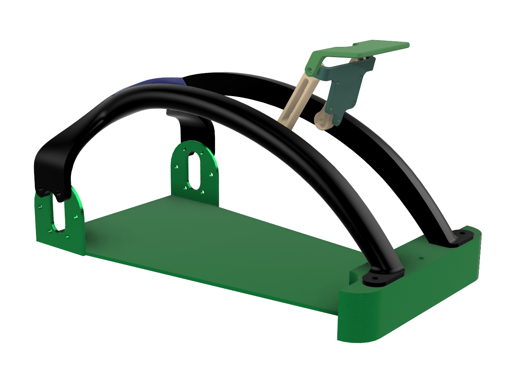
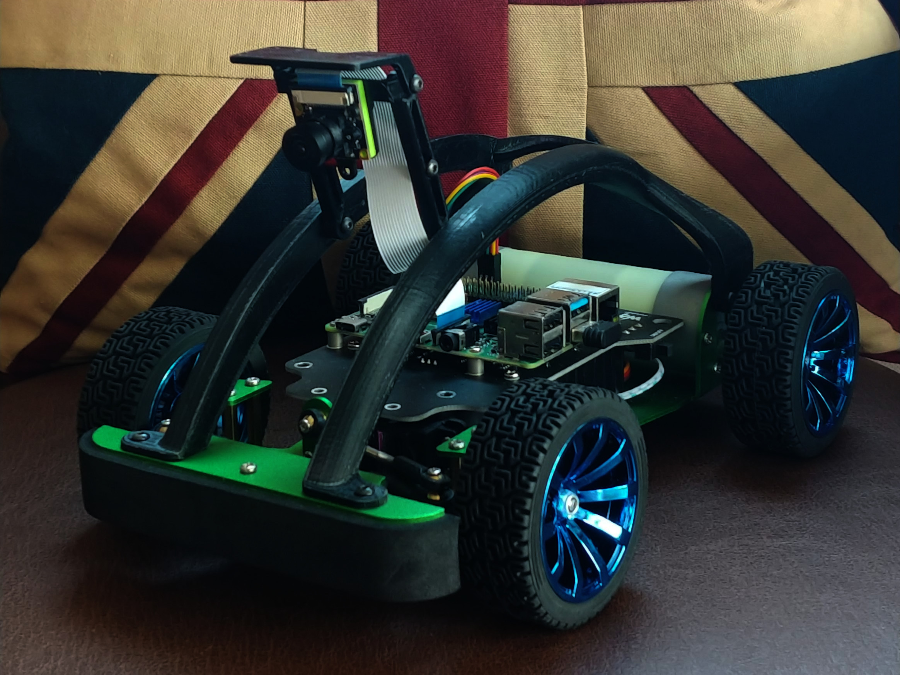

# OROCAR_v2
A low-cost learning platform for SLAM, Autonomous Driving, and Indoor Racing

## Hardware
The car body is from the Waveshare Jetracer AI Kit [(link)](https://www.waveshare.com/jetracer-ai-kit.htm). You can 3d print the frame and the alternative camera mounting solution found in the assets folder. The .stp and the original .f3z file is also in this folder should you wish to modify the designs.

  
  

## Lane Tracking
After converting the camera image to HSV space, thresholding the output and applying a warp function (warp points shown top right), we obtained the second image. Summing the number of white pixels in the vertical axis along the frameWidth gave a histogram (shown bottom left), which allowed the initialization of the slidingwindow algorithm. The mid-points of our windows were used to estimate the lanes via a polyfit approach and the detected lane is shown on the bottom right.

Due to the narrow angle view of the Raspberry camera, there arises some occasions where only one of the lanes is detected in the warp view.\

  

